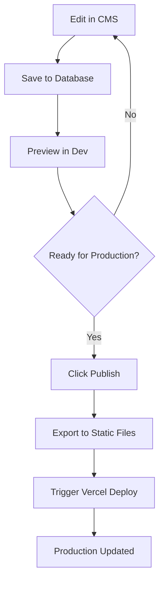

# 🚀 CMS Publish-to-Deploy System

This document explains the **hybrid translation system** that combines the benefits of both database-driven CMS editing and static file builds.

## 🎯 **System Overview**

### **The Problem We Solved**
- **Pure Database**: CMS works but Vercel builds fail (no DB access during build)
- **Pure Static**: Vercel builds work but CMS becomes useless (no real-time editing)

### **Our Solution: Hybrid System**
✅ **Database** = Source of truth for CMS editing  
✅ **Static Files** = Build artifacts for Vercel deployment  
✅ **Publish Button** = Bridges the two systems  

## 🔄 **How It Works**

### **Development Mode**
1. **Edit translations** in CMS (`/cms/translations`)
2. **Changes save to database** in real-time
3. **Dynamic API** serves translations (`/api/translations/namespace/[namespace]`)
4. **Live preview** works immediately

### **Production Deployment**
1. **Click "Publish to Production"** in CMS
2. **Export script runs** (`scripts/export-translations.ts`)
3. **Static JSON files generated** (`lib/i18n/locales/`)
4. **Vercel deployment triggered** (via deploy hook)
5. **Production uses static files** (fast, reliable)

## 📁 **File Structure**

```
lib/i18n/
├── locales/                    # 📤 Generated static files
│   ├── en/
│   │   ├── common.json        # Static translations
│   │   ├── navigation.json
│   │   └── ...
│   ├── fr/
│   └── _export-summary.json   # 📊 Export metadata
├── config.ts                  # 🔧 i18n configuration
├── dynamic-hook.ts            # 🌐 Dynamic API hook
├── enhanced-hook.ts           # 🎯 Hybrid hook (static + dynamic)
└── index.ts                   # 📦 Main exports

scripts/
└── export-translations.ts     # 📤 DB → Static files

src/app/api/
├── cms/publish/route.ts       # 🚀 Publish endpoint
└── translations/              # 🌐 Dynamic translation APIs
```

## 🛠️ **Setup Instructions**

### **1. Vercel Deploy Hook**

1. Go to **Vercel Dashboard** → Your Project → **Settings** → **Git**
2. Create a **Deploy Hook**:
   - Name: `CMS Translation Publish`
   - Branch: `main` (or your production branch)
3. Copy the hook URL
4. Add to your `.env` file:
   ```bash
   VERCEL_DEPLOY_HOOK_URL="https://api.vercel.com/v1/integrations/deploy/YOUR_HOOK_ID"
   ```

### **2. Environment Variables**

**Development (.env.local):**
```bash
DATABASE_URL="postgresql://..."
VERCEL_DEPLOY_HOOK_URL="https://api.vercel.com/v1/integrations/deploy/YOUR_HOOK_ID"
```

**Production (Vercel):**
```bash
DATABASE_URL="postgresql://..."  # Your production database
VERCEL_DEPLOY_HOOK_URL="https://..."  # Same deploy hook
```

## 🎮 **Usage Guide**

### **For Content Editors**

1. **Edit Translations:**
   - Go to `/cms/translations`
   - Edit any translation in real-time
   - Changes are immediately visible in development

2. **Publish to Production:**
   - Click **"Publish to Production"** button
   - Wait for export and deployment
   - Production site updates automatically

### **For Developers**

1. **Local Development:**
   ```bash
   npm run dev                    # Uses database + dynamic API
   npm run export-translations   # Manual export to static files
   npm run i18n:generate         # Regenerate i18n hooks
   ```

2. **Production Build:**
   ```bash
   npm run build                 # Uses static files (no DB needed)
   ```

## 🔧 **Technical Details**

### **Translation Loading Strategy**

```typescript
// In development: Database → Dynamic API
const { t, isLoading } = useTranslation("common", { useDynamic: true });

// In production: Static files → Immediate
const { t } = useTranslation("common"); // Uses static fallback
```

### **Build Environment Detection**

```typescript
// scripts/generate-i18n-types.ts
if (process.env.VERCEL || process.env.CI) {
  // Build environment: Use existing static files or create minimal fallbacks
  await createHybridI18nFiles();
} else {
  // Development: Generate from database
  await generateFullI18nFiles();
}
```

### **Export Process**

```typescript
// scripts/export-translations.ts
1. Fetch all translations from database
2. Group by language and namespace
3. Generate static JSON files
4. Create export summary
```

### **Publish API**

```typescript
// src/app/api/cms/publish/route.ts
POST /api/cms/publish
1. Export translations to static files
2. Trigger Vercel deployment via webhook
3. Return status and deployment info
```

## 🚨 **Troubleshooting**

### **"No translation keys found" in production CMS**
- **Cause**: Production database is empty
- **Solution**: Seed production database or use staging database

### **Build fails with "Cannot find module"**
- **Cause**: Missing static files and no database access
- **Solution**: Run `npm run export-translations` locally and commit files

### **Publish button doesn't trigger deployment**
- **Cause**: Missing or invalid `VERCEL_DEPLOY_HOOK_URL`
- **Solution**: Check environment variable and Vercel hook configuration

### **Translations not updating in production**
- **Cause**: Deployment failed or static files not updated
- **Solution**: Check Vercel deployment logs and re-publish

## 🎉 **Benefits**

### **For Content Teams**
- ✅ Real-time editing in CMS
- ✅ Live preview in development
- ✅ One-click publishing to production
- ✅ No technical knowledge required

### **For Development Teams**
- ✅ Fast, reliable production builds
- ✅ No database dependency in build
- ✅ Version control of translations
- ✅ Automated deployment pipeline

### **For Operations**
- ✅ Reduced build failures
- ✅ Better performance (static files)
- ✅ Clear deployment tracking
- ✅ Rollback capability

## 📈 **Workflow Example**



This system gives you the **best of both worlds**: powerful CMS editing with reliable, fast production deployments! 🚀

